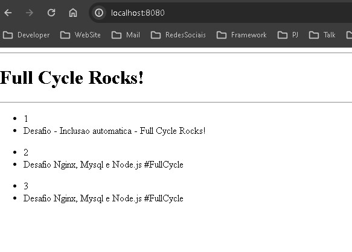
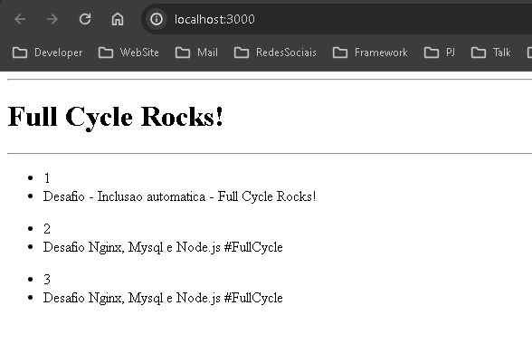
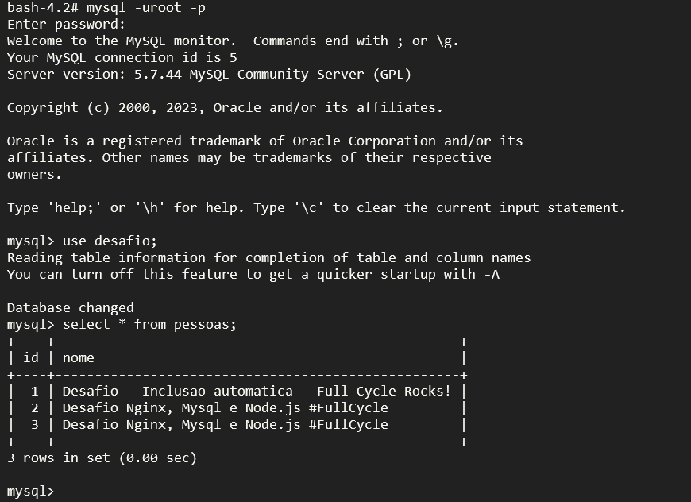

Desafio Nginx Proxy Reverso Node.js e Mysql
- Nesse desafio você colocará em prática o que aprendemos em relação a utilização do nginx como proxy reverso. A idéia principal é que quando um usuário acesse o nginx, o mesmo fará uma chamada em nossa aplicação node.js. Essa aplicação por sua vez adicionará um registro em nosso banco de dados mysql, cadastrando um nome na tabela people.

O retorno da aplicação node.js para o nginx deverá ser:

<h1>Full Cycle Rocks!</h1>
- Lista de nomes cadastrada no banco de dados.

- Evidencia Nginx:

- Evidencia Node:

- Evidencia MySQL:

Gere o docker-compose de uma forma que basta apenas rodarmos: docker-compose up -d que tudo deverá estar funcionando e disponível na porta: 8080.
